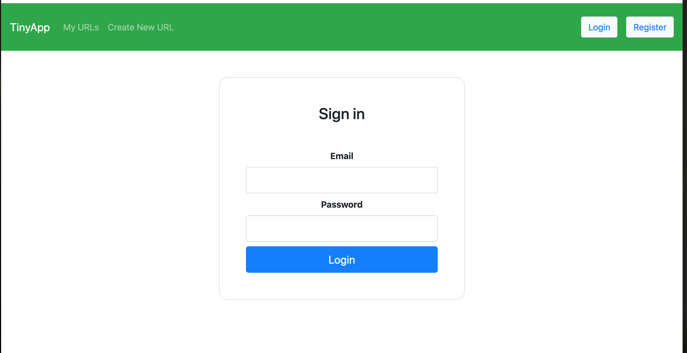
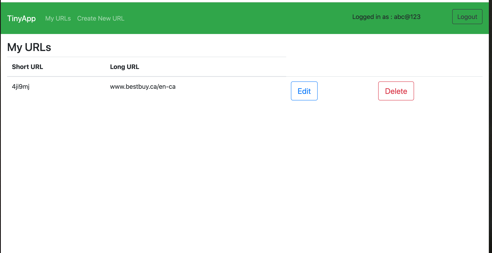
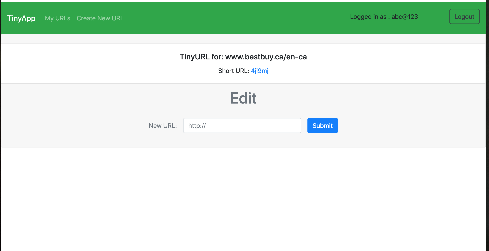
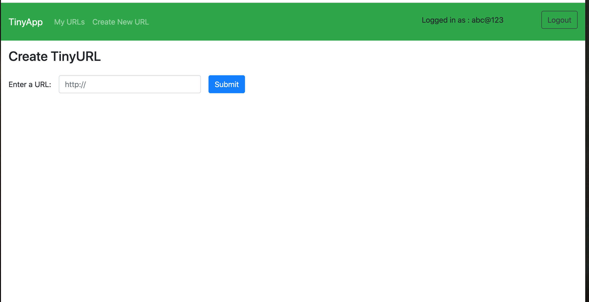
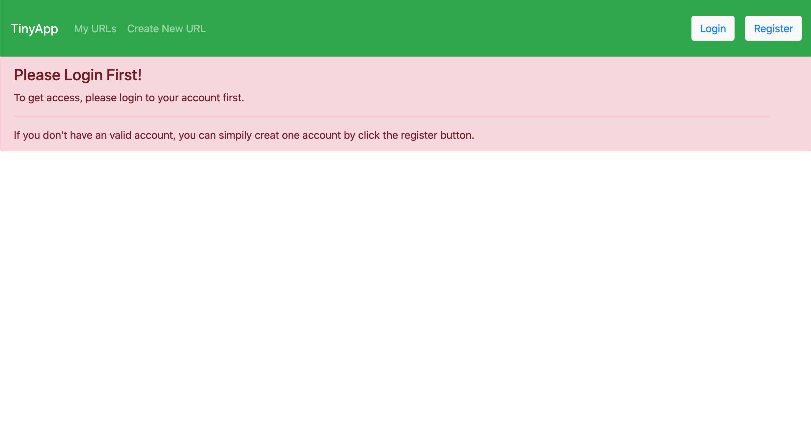

# TinyApp Project

TinyApp is a full stack web application built with Node and Express that allows users to shorten long URLs (à la bit.ly).

## Final Product

## Dependencies

- Node.js
- Express
- EJS
- bcrypt
- body-parser
- cookie-session

## Dev Dependencies

- Nodemon
- Mocha
- Chai

## Getting Started

- Install all dependencies (using the `npm install` command).
- Run the development web server using the `node express_server.js` command.

## File Structure

# Server
- express_server.js
- helpers.js

# Views
- _header.ejs
- urls_index.ejs
- urls_login.ejs
- urls_new.ejs
- urls_notAllowed.ejs
- urls_notLogin.ejs
- urls_registration.ejs
- urls_show.ejs

# Test
helpersTest.js

